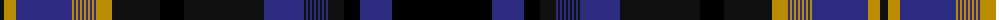

The parent of this is [Manitoba (Commemorative)](/tartans/k/8/dy12/db56/dy2/db2/dy2/db2/dy2/db2/dy2/db2/dy2/db2/dy2/db2/dy16/k48/ka24/k80/db40/k2/db2/k2/db2/k2/db2/k2/db2/k2/db2/k2/db2/k16/ka16/db32/ka/100/)

This was sourced from tartans-authority.  It is a [36 stripes tartan](/stripes/stripes36/).

Original link http://www.tartansauthority.com/tartan-ferret/display/7726/

## Thread count
K/8 DY12 DB56 DY2 DB2 DY2 DB2 DY2 DB2 DY2 DB2 DY2 DB2 DY2 DB2 DY16 K48 Ka24 K80 DB40 K2 DB2 K2 DB2 K2 DB2 K2 DB2 K2 DB2 K2 DB2 K16 Ka16 DB32 Ka/100

## Palette
Each colour and its ΔE from the base-6 reference it is a variant of.

| Colour | Shade | Base | ΔE (OKLab) |
|---|---|---|---|
| DB |  `#2C2C80` | B  | 0.05 |
| DY |  `#BC8C00` | Y  | 0.16 |
| K |  `#101010` | K  | 0.17 |
| Ka |  `#000000` | K  | 0.00 |

ID: /variants/k/8/dy12/db56/dy2/db2/dy2/db2/dy2/db2/dy2/db2/dy2/db2/dy2/db2/dy16/k48/ka24/k80/db40/k2/db2/k2/db2/k2/db2/k2/db2/k2/db2/k2/db2/k16/ka16/db32/ka/100-db2c2c80-dybc8c00-k101010-ka000000/
