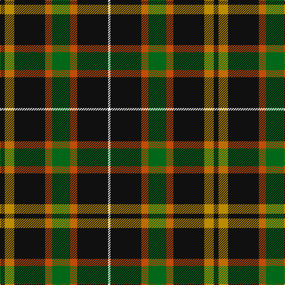

The parent of this is [Holestone (Corporate)](/tartans/k/8/dy16/k52/do12/g30/do12/k52/w/4/)

This was sourced from tartans-authority.  It is a [8 stripes tartan](/stripes/stripes8/).

Original link http://www.tartansauthority.com/tartan-ferret/display/6734/

## Thread count
K/8 DY16 K52 DO12 G30 DO12 K52 W/4

## Palette
Each colour and its ΔE from the base-6 reference it is a variant of.

| Colour | Shade | Base | ΔE (OKLab) |
|---|---|---|---|
| DO |  `#C04C08` | R  | 0.08 |
| DY |  `#BC8C00` | Y  | 0.16 |
| G |  `#006818` | G  | 0.02 |
| K |  `#101010` | K  | 0.17 |
| W |  `#F8F8F8` | W  | 0.01 |

# Sample pattern

ID: /variants/k/8/dy16/k52/do12/g30/do12/k52/w/4-doc04c08-dybc8c00-g006818-k101010-wf8f8f8/
