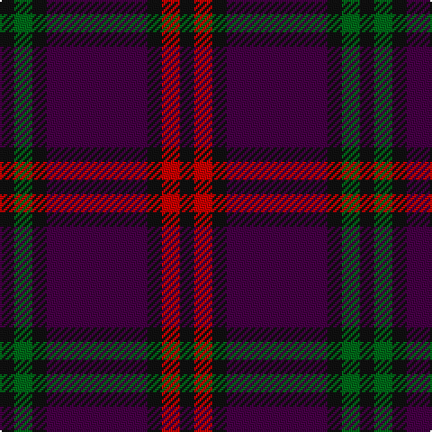

The parent of this is [Montgomery - 1819 (Clan)](/tartans/k/8/g10/k8/dp56/k8/r10/k/8/)

This was sourced from tartans-authority.  It is a [7 stripes tartan](/stripes/stripes7/).

Original link http://www.tartansauthority.com/tartan-ferret/display/1082/

## Thread count
K/8 G10 K8 DP56 K8 R10 K/8

## Palette
Each colour and its ΔE from the base-6 reference it is a variant of.

| Colour | Shade | Base | ΔE (OKLab) |
|---|---|---|---|
| DP |  `#440044` | B  | 0.17 |
| G |  `#006818` | G  | 0.02 |
| K |  `#101010` | K  | 0.17 |
| R |  `#C80000` | R  | 0.00 |

# Sample pattern

ID: /variants/k/8/g10/k8/dp56/k8/r10/k/8-dp440044-g006818-k101010-rc80000/
