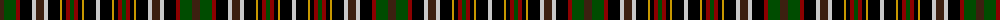

The parent of this is [Wcwm 1572-2](/tartans/k/8/g12/dr4/ka12/n4/k8/n4/ka12/dy2/ka4/dr4/g4/dr4/ka4/dy2/ka12/n/4/)

This was sourced from register-of-tartans.  It is a [17 stripes tartan](/stripes/stripes17/).

Original link https://www.tartanregister.gov.uk/tartanDetails.aspx?ref=4533

## Thread count
K/8 G12 DR4 Ka12 N4 K8 N4 Ka12 DY2 Ka4 DR4 G4 DR4 Ka4 DY2 Ka12 N/4

## Palette
Each colour and its ΔE from the base-6 reference it is a variant of.

| Colour | Shade | Base | ΔE (OKLab) |
|---|---|---|---|
| DR |  `#8C0000` | R  | 0.13 |
| DY |  `#C89800` | Y  | 0.12 |
| G |  `#004C00` | G  | 0.08 |
| K |  `#3C2010` | B  | 0.20 |
| Ka |  `#000000` | K  | 0.00 |
| N |  `#C8C8C8` | W  | 0.13 |

ID: /variants/k/8/g12/dr4/ka12/n4/k8/n4/ka12/dy2/ka4/dr4/g4/dr4/ka4/dy2/ka12/n/4-dr8c0000-dyc89800-g004c00-k3c2010-ka000000-nc8c8c8/
