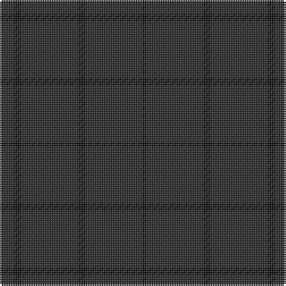

The parent of this is [Ben Dubh (The Black Mount)](/tartans/k/8/ka4/k32/ka4/k32/ka/2/)

This was sourced from register-of-tartans.  It is a [6 stripes tartan](/stripes/stripes6/).

Original link https://www.tartanregister.gov.uk/tartanDetails.aspx?ref=5881

## Thread count
K/8 Ka4 K32 Ka4 K32 Ka/2

## Palette
Each colour and its ΔE from the base-6 reference it is a variant of.

| Colour | Shade | Base | ΔE (OKLab) |
|---|---|---|---|
| K |  `#282828` | B  | 0.17 |
| Ka |  `#101010` | K  | 0.17 |

# Sample pattern

ID: /variants/k/8/ka4/k32/ka4/k32/ka/2-k282828-ka101010/
