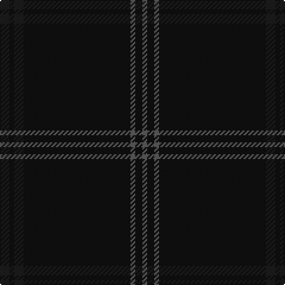

The parent of this is [STLTH (Corporate)](/tartans/k/8/ka4/k8/ka90/n4/ka6/n/4/)

This was sourced from tartans-authority.  It is a [7 stripes tartan](/stripes/stripes7/).

Original link http://www.tartansauthority.com/tartan-ferret/display/10752/

## Thread count
K/8 Ka4 K8 Ka90 N4 Ka6 N/4

## Palette
Each colour and its ΔE from the base-6 reference it is a variant of.

| Colour | Shade | Base | ΔE (OKLab) |
|---|---|---|---|
| K |  `#1C1C1C` | B  | 0.20 |
| Ka |  `#101010` | K  | 0.17 |
| N |  `#5C5C5C` | B  | 0.14 |

# Sample pattern

ID: /variants/k/8/ka4/k8/ka90/n4/ka6/n/4-k1c1c1c-ka101010-n5c5c5c/
