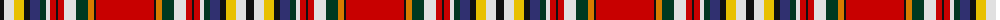

The parent of this is [Elmore (Personal)](/tartans/k/8/ln10/y10/k6/db10/dg6/ln4/r6/k2/r6/ln12/dg12/o6/k2/r/58/)

This was sourced from tartans-authority.  It is a [15 stripes tartan](/stripes/stripes15/).

Original link http://www.tartansauthority.com/tartan-ferret/display/3998/

## Thread count
K/8 LN10 Y10 K6 DB10 DG6 LN4 R6 K2 R6 LN12 DG12 O6 K2 R/58

## Palette
Each colour and its ΔE from the base-6 reference it is a variant of.

| Colour | Shade | Base | ΔE (OKLab) |
|---|---|---|---|
| DB |  `#303070` | B  | 0.05 |
| DG |  `#003820` | G  | 0.16 |
| K |  `#101010` | K  | 0.17 |
| LN |  `#E0E0E0` | W  | 0.06 |
| O |  `#D87C00` | Y  | 0.17 |
| R |  `#C80000` | R  | 0.00 |
| Y |  `#E8C000` | Y  | 0.00 |

ID: /variants/k/8/ln10/y10/k6/db10/dg6/ln4/r6/k2/r6/ln12/dg12/o6/k2/r/58-db303070-dg003820-k101010-lne0e0e0-od87c00-rc80000-ye8c000/
