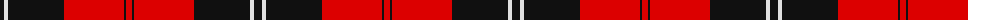

The parent of this is [Ramsay of Dalhousie](/tartans/k/8/ln4/k56/r60/k2/r/6/)

This was sourced from register-of-tartans.  It is a [6 stripes tartan](/stripes/stripes6/).

Original link https://www.tartanregister.gov.uk/tartanDetails.aspx?ref=3455

## Thread count
K/8 LN4 K56 R60 K2 R/6

## Palette
Each colour and its ΔE from the base-6 reference it is a variant of.

| Colour | Shade | Base | ΔE (OKLab) |
|---|---|---|---|
| K |  `#101010` | K  | 0.17 |
| LN |  `#E0E0E0` | W  | 0.06 |
| R |  `#DC0000` | R  | 0.04 |

# Sample pattern

ID: /variants/k/8/ln4/k56/r60/k2/r/6-k101010-lne0e0e0-rdc0000/
