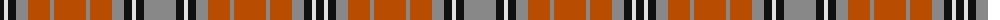

The parent of this is [Sydney (Nova Scotia) #2](/tartans/k/8/ln4/k8/n12/do22/n4/do32/n4/do22/n12/k8/ln4/k8/n/32/)

This was sourced from register-of-tartans.  It is a [14 stripes tartan](/stripes/stripes14/).

Original link https://www.tartanregister.gov.uk/tartanDetails.aspx?ref=4058

## Thread count
K/8 LN4 K8 N12 DO22 N4 DO32 N4 DO22 N12 K8 LN4 K8 N/32

## Palette
Each colour and its ΔE from the base-6 reference it is a variant of.

| Colour | Shade | Base | ΔE (OKLab) |
|---|---|---|---|
| DO |  `#B84C00` | R  | 0.08 |
| K |  `#101010` | K  | 0.17 |
| LN |  `#E0E0E0` | W  | 0.06 |
| N |  `#888888` | R  | 0.24 |

ID: /variants/k/8/ln4/k8/n12/do22/n4/do32/n4/do22/n12/k8/ln4/k8/n/32-dob84c00-k101010-lne0e0e0-n888888/
