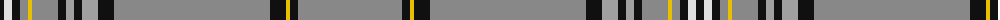

The parent of this is [Maxem Eyewear (Corporate)](/tartans/k/8/ln8/k8/na8/y4/na26/k8/n8/k8/n16/k16/na156/k16/y4/k8/na/104/)

This was sourced from tartans-authority.  It is a [16 stripes tartan](/stripes/stripes16/).

Original link http://www.tartansauthority.com/tartan-ferret/display/10093/

## Thread count
K/8 LN8 K8 Na8 Y4 Na26 K8 N8 K8 N16 K16 Na156 K16 Y4 K8 Na/104

## Palette
Each colour and its ΔE from the base-6 reference it is a variant of.

| Colour | Shade | Base | ΔE (OKLab) |
|---|---|---|---|
| K |  `#101010` | K  | 0.17 |
| LN |  `#E0E0E0` | W  | 0.06 |
| N |  `#A0A0A0` | Y  | 0.20 |
| Na |  `#888888` | R  | 0.24 |
| Y |  `#E8C000` | Y  | 0.00 |

ID: /variants/k/8/ln8/k8/na8/y4/na26/k8/n8/k8/n16/k16/na156/k16/y4/k8/na/104-k101010-lne0e0e0-na0a0a0-na888888-ye8c000/
