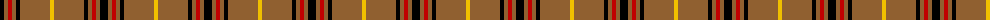
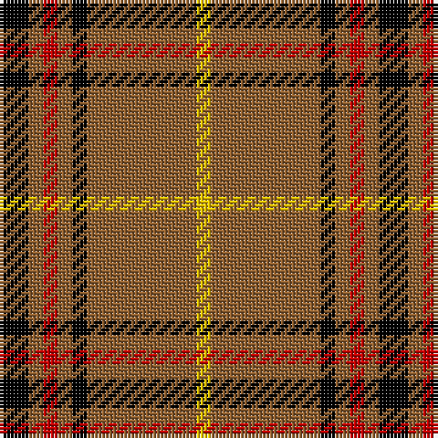

The parent of this is [Welsh, National](/tartans/k/8/lt4/r4/lt4/k4/lt30/y/4/)

This was sourced from weddslist.  It is a [7 stripes tartan](/stripes/stripes7/).

Original link http://www.weddslist.com/cgi-bin/tartans/pg.pl?source=sts

## Thread count
K/8 LT4 R4 LT4 K4 LT30 Y/4

## Palette
Each colour and its ΔE from the base-6 reference it is a variant of.

| Colour | Shade | Base | ΔE (OKLab) |
|---|---|---|---|
| K |  `#000000` | K  | 0.00 |
| LT |  `#906030` | R  | 0.15 |
| R |  `#C00000` | R  | 0.02 |
| Y |  `#F0C000` | Y  | 0.01 |

# Sample pattern

ID: /variants/k/8/lt4/r4/lt4/k4/lt30/y/4-k000000-lt906030-rc00000-yf0c000/
