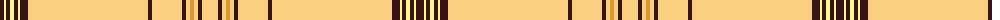

The parent of this is [UPS No. 1 (Corporate)](/tartans/k/8/ly2/k4/ly4/k4/ly2/k8/lya120/k4/lya30/k4/lya4/y4/lya4/k4/lya/16/)

This was sourced from tartans-authority.  It is a [16 stripes tartan](/stripes/stripes16/).

Original link http://www.tartansauthority.com/tartan-ferret/display/10023/

## Thread count
K/8 LY2 K4 LY4 K4 LY2 K8 LYa120 K4 LYa30 K4 LYa4 Y4 LYa4 K4 LYa/16

## Palette
Each colour and its ΔE from the base-6 reference it is a variant of.

| Colour | Shade | Base | ΔE (OKLab) |
|---|---|---|---|
| K |  `#381414` | B  | 0.21 |
| LY |  `#FCF890` | W  | 0.12 |
| LYa |  `#F8D080` | Y  | 0.09 |
| Y |  `#DC982C` | Y  | 0.11 |

ID: /variants/k/8/ly2/k4/ly4/k4/ly2/k8/lya120/k4/lya30/k4/lya4/y4/lya4/k4/lya/16-k381414-lyfcf890-lyaf8d080-ydc982c/
