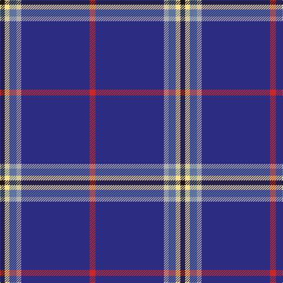

The parent of this is [Kendle (2013)](/tartans/k/8/ly8/b12/n8/db116/r/10/)

This was sourced from register-of-tartans.  It is a [6 stripes tartan](/stripes/stripes6/).

Original link https://www.tartanregister.gov.uk/tartanDetails.aspx?ref=10932

## Thread count
K/8 LY8 B12 N8 DB116 R/10

## Palette
Each colour and its ΔE from the base-6 reference it is a variant of.

| Colour | Shade | Base | ΔE (OKLab) |
|---|---|---|---|
| B |  `#5F749C` | B  | 0.17 |
| DB |  `#2C2C80` | B  | 0.05 |
| K |  `#1C1714` | K  | 0.21 |
| LY |  `#F8E38C` | Y  | 0.11 |
| N |  `#B0B0B0` | Y  | 0.18 |
| R |  `#C82828` | R  | 0.03 |

# Sample pattern

ID: /variants/k/8/ly8/b12/n8/db116/r/10-b5f749c-db2c2c80-k1c1714-lyf8e38c-nb0b0b0-rc82828/
