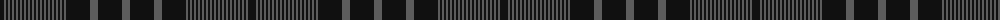

The parent of this is [MacKay, Marled](/tartans/k/8/n2/k2/n2/k2/n2/k2/n2/k2/n2/k2/n2/k2/n2/k2/n2/k2/n2/k2/n2/k2/n2/k2/n2/k2/n2/k2/n2/k2/n2/k2/n2/k24/n8/k24/n/8/)

This was sourced from register-of-tartans.  It is a [36 stripes tartan](/stripes/stripes36/).

Original link https://www.tartanregister.gov.uk/tartanDetails.aspx?ref=2506

## Thread count
K/8 N2 K2 N2 K2 N2 K2 N2 K2 N2 K2 N2 K2 N2 K2 N2 K2 N2 K2 N2 K2 N2 K2 N2 K2 N2 K2 N2 K2 N2 K2 N2 K24 N8 K24 N/8

## Palette
Each colour and its ΔE from the base-6 reference it is a variant of.

| Colour | Shade | Base | ΔE (OKLab) |
|---|---|---|---|
| K |  `#101010` | K  | 0.17 |
| N |  `#5C5C5C` | B  | 0.14 |

ID: /variants/k/8/n2/k2/n2/k2/n2/k2/n2/k2/n2/k2/n2/k2/n2/k2/n2/k2/n2/k2/n2/k2/n2/k2/n2/k2/n2/k2/n2/k2/n2/k2/n2/k24/n8/k24/n/8-k101010-n5c5c5c/
