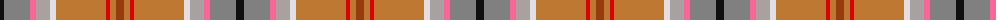

The parent of this is [Australian Donkey](/tartans/k/8/n26/lr6/na14/ln6/do50/r4/do6/t/8/)

This was sourced from register-of-tartans.  It is a [9 stripes tartan](/stripes/stripes9/).

Original link https://www.tartanregister.gov.uk/tartanDetails.aspx?ref=5923

## Thread count
K/8 N26 LR6 Na14 LN6 DO50 R4 DO6 T/8

## Palette
Each colour and its ΔE from the base-6 reference it is a variant of.

| Colour | Shade | Base | ΔE (OKLab) |
|---|---|---|---|
| DO |  `#BE7832` | R  | 0.17 |
| K |  `#101010` | K  | 0.17 |
| LN |  `#E0E0E0` | W  | 0.06 |
| LR |  `#FA6496` | R  | 0.21 |
| N |  `#808080` | G  | 0.22 |
| Na |  `#A9A0A0` | Y  | 0.20 |
| R |  `#DC0000` | R  | 0.04 |
| T |  `#963C0F` | R  | 0.10 |

ID: /variants/k/8/n26/lr6/na14/ln6/do50/r4/do6/t/8-dobe7832-k101010-lne0e0e0-lrfa6496-n808080-naa9a0a0-rdc0000-t963c0f/
