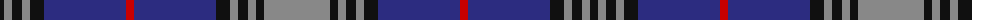

The parent of this is [Kinnaird Family Tartan Tartan Number: 2242. Earliest known date: March 1996 For the Kinnaird Worldwide Association - http://www.kinnaird.net. From the Kinnaird website it would seem that anyone is free to weave this tartan (Feb 2005). See products available Copyright © Blair Urquhart, Comrie, 2015](/tartans/k/8/n8/k10/n8/k14/db82/r8/db82/k14/n8/k10/n8/k8/n/66/)

This was sourced from house-of-tartan.  It is a [14 stripes tartan](/stripes/stripes14/).

Original link http://www.house-of-tartan.scotland.net/house/TartanViewjs.asp?colr=Def&tnam=2242

## Thread count
K/8 N8 K10 N8 K14 DB82 R8 DB82 K14 N8 K10 N8 K8 N/66

## Palette
Each colour and its ΔE from the base-6 reference it is a variant of.

| Colour | Shade | Base | ΔE (OKLab) |
|---|---|---|---|
| DB |  `#2C2C80` | B  | 0.05 |
| K |  `#101010` | K  | 0.17 |
| N |  `#888888` | R  | 0.24 |
| R |  `#C80000` | R  | 0.00 |

ID: /variants/k/8/n8/k10/n8/k14/db82/r8/db82/k14/n8/k10/n8/k8/n/66-db2c2c80-k101010-n888888-rc80000/
