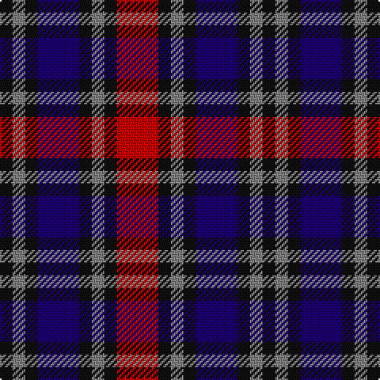

The parent of this is [Clark, Red](/tartans/k/8/n8/k8/db26/k8/n8/k8/r/26/)

This was sourced from register-of-tartans.  It is a [8 stripes tartan](/stripes/stripes8/).

Original link https://www.tartanregister.gov.uk/tartanDetails.aspx?ref=668

## Thread count
K/8 N8 K8 DB26 K8 N8 K8 R/26

## Palette
Each colour and its ΔE from the base-6 reference it is a variant of.

| Colour | Shade | Base | ΔE (OKLab) |
|---|---|---|---|
| DB |  `#1C0070` | B  | 0.14 |
| K |  `#101010` | K  | 0.17 |
| N |  `#808080` | G  | 0.22 |
| R |  `#C80000` | R  | 0.00 |

# Sample pattern

ID: /variants/k/8/n8/k8/db26/k8/n8/k8/r/26-db1c0070-k101010-n808080-rc80000/
