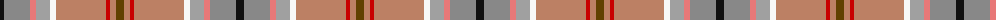

The parent of this is [Australian Donkey (Corporate)](/tartans/k/8/na26/lr6/n14/w6/lt50/r4/lt6/t/8/)

This was sourced from tartans-authority.  It is a [9 stripes tartan](/stripes/stripes9/).

Original link http://www.tartansauthority.com/tartan-ferret/display/7069/

## Thread count
K/8 Na26 LR6 N14 W6 LT50 R4 LT6 T/8

## Palette
Each colour and its ΔE from the base-6 reference it is a variant of.

| Colour | Shade | Base | ΔE (OKLab) |
|---|---|---|---|
| K |  `#101010` | K  | 0.17 |
| LR |  `#E87878` | R  | 0.19 |
| LT |  `#BC8064` | R  | 0.19 |
| N |  `#A0A0A0` | Y  | 0.20 |
| Na |  `#888888` | R  | 0.24 |
| R |  `#C80000` | R  | 0.00 |
| T |  `#604000` | G  | 0.14 |
| W |  `#F8F8F8` | W  | 0.01 |

ID: /variants/k/8/na26/lr6/n14/w6/lt50/r4/lt6/t/8-k101010-lre87878-ltbc8064-na0a0a0-na888888-rc80000-t604000-wf8f8f8/
