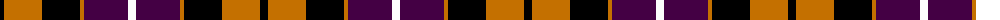

The parent of this is [Dutch](/tartans/k/8/o38/k38/o4/dp44/w/8/)

This was sourced from register-of-tartans.  It is a [6 stripes tartan](/stripes/stripes6/).

Original link https://www.tartanregister.gov.uk/tartanDetails.aspx?ref=1054

## Thread count
K/8 O38 K38 O4 DP44 W/8

## Palette
Each colour and its ΔE from the base-6 reference it is a variant of.

| Colour | Shade | Base | ΔE (OKLab) |
|---|---|---|---|
| DP |  `#440044` | B  | 0.17 |
| K |  `#000000` | K  | 0.00 |
| O |  `#C47000` | R  | 0.16 |
| W |  `#FCFCFC` | W  | 0.03 |

# Sample pattern

ID: /variants/k/8/o38/k38/o4/dp44/w/8-dp440044-k000000-oc47000-wfcfcfc/
