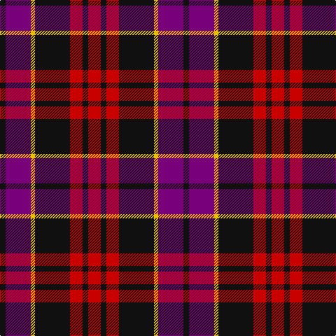

The parent of this is [Wounded Warriors Canada](/tartans/k/8/p36/y6/k50/r18/k8/r/18/)

This was sourced from tartans-authority.  It is a [7 stripes tartan](/stripes/stripes7/).

Original link http://www.tartansauthority.com/tartan-ferret/display/11215/

## Thread count
K/8 P36 Y6 K50 R18 K8 R/18

## Palette
Each colour and its ΔE from the base-6 reference it is a variant of.

| Colour | Shade | Base | ΔE (OKLab) |
|---|---|---|---|
| K |  `#101010` | K  | 0.17 |
| P |  `#780078` | B  | 0.16 |
| R |  `#C80000` | R  | 0.00 |
| Y |  `#E8C000` | Y  | 0.00 |

# Sample pattern

ID: /variants/k/8/p36/y6/k50/r18/k8/r/18-k101010-p780078-rc80000-ye8c000/
