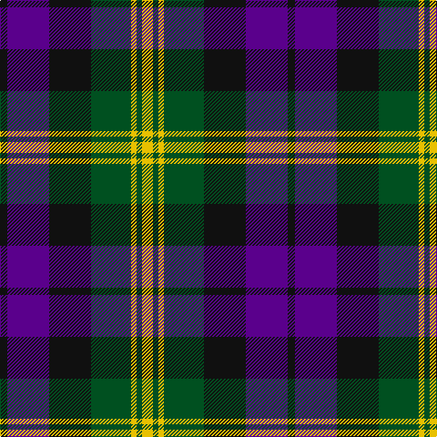

The parent of this is [Gordon of Esslemont](/tartans/k/8/p46/k46/g44/y6/g6/y/12/)

This was sourced from register-of-tartans.  It is a [7 stripes tartan](/stripes/stripes7/).

Original link https://www.tartanregister.gov.uk/tartanDetails.aspx?ref=1464

## Thread count
K/8 P46 K46 G44 Y6 G6 Y/12

## Palette
Each colour and its ΔE from the base-6 reference it is a variant of.

| Colour | Shade | Base | ΔE (OKLab) |
|---|---|---|---|
| G |  `#005020` | G  | 0.08 |
| K |  `#101010` | K  | 0.17 |
| P |  `#5A008C` | B  | 0.12 |
| Y |  `#E8C000` | Y  | 0.00 |

# Sample pattern

ID: /variants/k/8/p46/k46/g44/y6/g6/y/12-g005020-k101010-p5a008c-ye8c000/
