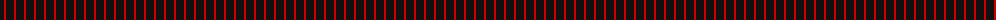
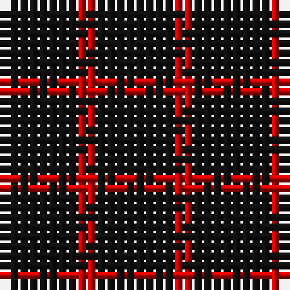

The parent of this is [St Kilda District Tartan Tartan Number: 1189. Earliest known date: pre 2003 Reconstructed by Dr Phil Smith from a fragment in the Royal Museum of Antiquities late of Queen Street, Edinburgh. Sample in Glasgow City Museum. No other details. See products available Copyright © Blair Urquhart, Comrie, 2015](/tartans/k/8/r/2/)

This was sourced from house-of-tartan.  It is a [2 stripes tartan](/stripes/stripes2/).

Original link http://www.house-of-tartan.scotland.net/house/TartanViewjs.asp?colr=Def&tnam=1189

## Thread count
K/8 R/2

## Palette
Each colour and its ΔE from the base-6 reference it is a variant of.

| Colour | Shade | Base | ΔE (OKLab) |
|---|---|---|---|
| K |  `#101010` | K  | 0.17 |
| R |  `#C80000` | R  | 0.00 |

# Sample pattern

ID: /variants/k/8/r/2-k101010-rc80000/
