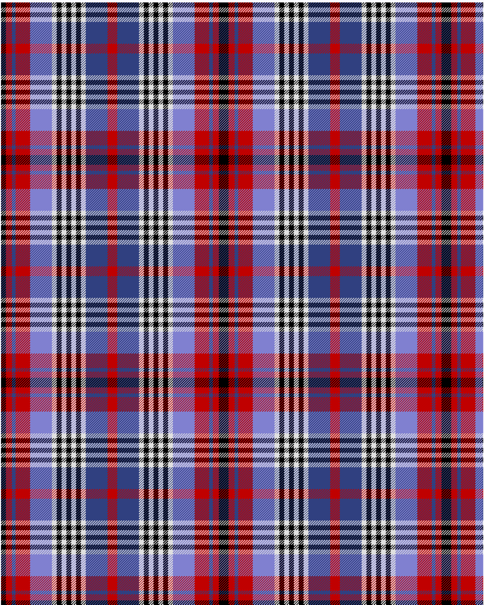

Edinburgh, Military Tattoo

This was sourced from <no value>.  It is a 14 stripes tartan.

Original link http://www.weddslist.com/cgi-bin/tartans/pg.pl?source=sts

## Thread count
K/8 R10 BA6 R24 B36 LN8 K8 LN8 K8 LN8 K8 LN8 BA36 R/8

## Palette
B#8080D0 BA#304080 K#000000 LN#E0E0E0 R#C00000

# Sample pattern

ID: /variants/k/8/r10/ba6/r24/b36/ln8/k8/ln8/k8/ln8/k8/ln8/ba36/r/8-b8080d0-ba304080-k000000-lne0e0e0-rc00000