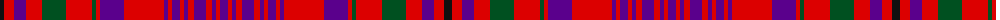

The parent of this is [Murray of Tullibardine #3](/tartans/k/8/r10/p12/r16/g24/r26/g4/r4/p24/r40/p4/r4/p8/r4/p4/r6/p12/r6/p4/r4/p/8/)

This was sourced from register-of-tartans.  It is a [21 stripes tartan](/stripes/stripes21/).

Original link https://www.tartanregister.gov.uk/tartanDetails.aspx?ref=3073

## Thread count
K/8 R10 P12 R16 G24 R26 G4 R4 P24 R40 P4 R4 P8 R4 P4 R6 P12 R6 P4 R4 P/8

## Palette
Each colour and its ΔE from the base-6 reference it is a variant of.

| Colour | Shade | Base | ΔE (OKLab) |
|---|---|---|---|
| G |  `#005020` | G  | 0.08 |
| K |  `#101010` | K  | 0.17 |
| P |  `#5A008C` | B  | 0.12 |
| R |  `#DC0000` | R  | 0.04 |

ID: /variants/k/8/r10/p12/r16/g24/r26/g4/r4/p24/r40/p4/r4/p8/r4/p4/r6/p12/r6/p4/r4/p/8-g005020-k101010-p5a008c-rdc0000/
