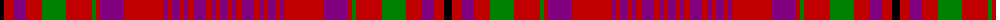

The parent of this is [Murray of Tullibardine 3](/tartans/k/8/r10/p12/r16/g24/r26/g4/r4/p24/r40/p4/r4/p8/r4/p4/r6/p12/r6/p4/r4/p/8/)

This was sourced from weddslist.  It is a [21 stripes tartan](/stripes/stripes21/).

Original link http://www.weddslist.com/cgi-bin/tartans/pg.pl?source=sts

## Thread count
K/8 R10 P12 R16 G24 R26 G4 R4 P24 R40 P4 R4 P8 R4 P4 R6 P12 R6 P4 R4 P/8

## Palette
Each colour and its ΔE from the base-6 reference it is a variant of.

| Colour | Shade | Base | ΔE (OKLab) |
|---|---|---|---|
| G |  `#008000` | G  | 0.09 |
| K |  `#000000` | K  | 0.00 |
| P |  `#800080` | B  | 0.17 |
| R |  `#C00000` | R  | 0.02 |

ID: /variants/k/8/r10/p12/r16/g24/r26/g4/r4/p24/r40/p4/r4/p8/r4/p4/r6/p12/r6/p4/r4/p/8-g008000-k000000-p800080-rc00000/
