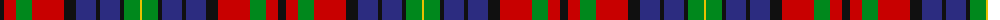

The parent of this is [MacBrine (Name)](/tartans/k/8/r12/g16/r32/k12/db20/k4/db20/k4/g16/y/2/)

This was sourced from tartans-authority.  It is a [11 stripes tartan](/stripes/stripes11/).

Original link http://www.tartansauthority.com/tartan-ferret/display/8230/

## Thread count
K/8 R12 G16 R32 K12 DB20 K4 DB20 K4 G16 Y/2

## Palette
Each colour and its ΔE from the base-6 reference it is a variant of.

| Colour | Shade | Base | ΔE (OKLab) |
|---|---|---|---|
| DB |  `#2C2C80` | B  | 0.05 |
| G |  `#00881C` | G  | 0.11 |
| K |  `#101010` | K  | 0.17 |
| R |  `#C80000` | R  | 0.00 |
| Y |  `#E8C000` | Y  | 0.00 |

ID: /variants/k/8/r12/g16/r32/k12/db20/k4/db20/k4/g16/y/2-db2c2c80-g00881c-k101010-rc80000-ye8c000/
