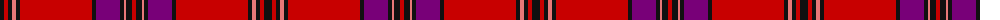

The parent of this is [Ruby Ramblers Red Hat (Corporate)](/tartans/k/8/r4/k4/lr4/k4/r72/k4/p24/k4/lr2/k6/r/4/)

This was sourced from tartans-authority.  It is a [12 stripes tartan](/stripes/stripes12/).

Original link http://www.tartansauthority.com/tartan-ferret/display/7177/

## Thread count
K/8 R4 K4 LR4 K4 R72 K4 P24 K4 LR2 K6 R/4

## Palette
Each colour and its ΔE from the base-6 reference it is a variant of.

| Colour | Shade | Base | ΔE (OKLab) |
|---|---|---|---|
| K |  `#101010` | K  | 0.17 |
| LR |  `#E87878` | R  | 0.19 |
| P |  `#780078` | B  | 0.16 |
| R |  `#C80000` | R  | 0.00 |

ID: /variants/k/8/r4/k4/lr4/k4/r72/k4/p24/k4/lr2/k6/r/4-k101010-lre87878-p780078-rc80000/
