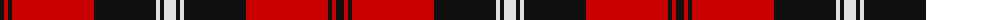

The parent of this is [Nebraska, University of American Corporate Tartan Tartan Number: 6955. Earliest known date: 2006 June This tartan weas designed by Strikke Designs of Hastings Nebraska and Lochcarron of Scotland to be used to support the Alumni Association. Colours are those of the University of Nebraska. Woven by Lochcarron. See products available Copyright © Blair Urquhart, Comrie, 2015](/tartans/k/8/r4/k4/r82/k62/ln4/k4/ln/12/)

This was sourced from house-of-tartan.  It is a [8 stripes tartan](/stripes/stripes8/).

Original link http://www.house-of-tartan.scotland.net/house/TartanViewjs.asp?colr=Def&tnam=6955

## Thread count
K/8 R4 K4 R82 K62 LN4 K4 LN/12

## Palette
Each colour and its ΔE from the base-6 reference it is a variant of.

| Colour | Shade | Base | ΔE (OKLab) |
|---|---|---|---|
| K |  `#101010` | K  | 0.17 |
| LN |  `#E0E0E0` | W  | 0.06 |
| R |  `#C80000` | R  | 0.00 |

# Sample pattern

ID: /variants/k/8/r4/k4/r82/k62/ln4/k4/ln/12-k101010-lne0e0e0-rc80000/
