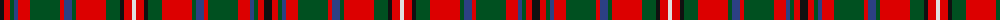

The parent of this is [MacKinnon #5](/tartans/k/8/r6/g4/b4/r12/g30/r4/b8/g4/r30/g14/k4/r8/ln/4/)

This was sourced from register-of-tartans.  It is a [14 stripes tartan](/stripes/stripes14/).

Original link https://www.tartanregister.gov.uk/tartanDetails.aspx?ref=2549

## Thread count
K/8 R6 G4 B4 R12 G30 R4 B8 G4 R30 G14 K4 R8 LN/4

## Palette
Each colour and its ΔE from the base-6 reference it is a variant of.

| Colour | Shade | Base | ΔE (OKLab) |
|---|---|---|---|
| B |  `#2C4084` | B  | 0.00 |
| G |  `#005020` | G  | 0.08 |
| K |  `#101010` | K  | 0.17 |
| LN |  `#E0E0E0` | W  | 0.06 |
| R |  `#DC0000` | R  | 0.04 |

ID: /variants/k/8/r6/g4/b4/r12/g30/r4/b8/g4/r30/g14/k4/r8/ln/4-b2c4084-g005020-k101010-lne0e0e0-rdc0000/
