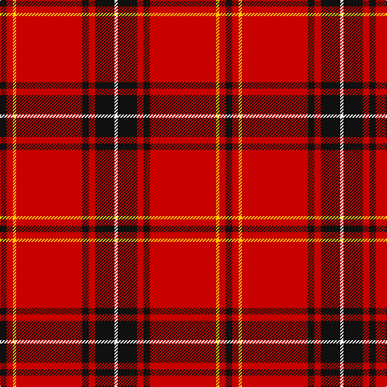

The parent of this is [Aberdeen F. C. (2002) (Sports)](/tartans/k/8/r8/y4/r82/k8/r8/k24/w/4/)

This was sourced from tartans-authority.  It is a [8 stripes tartan](/stripes/stripes8/).

Original link http://www.tartansauthority.com/tartan-ferret/display/4536/

## Thread count
K/8 R8 Y4 R82 K8 R8 K24 W/4

## Palette
Each colour and its ΔE from the base-6 reference it is a variant of.

| Colour | Shade | Base | ΔE (OKLab) |
|---|---|---|---|
| K |  `#101010` | K  | 0.17 |
| R |  `#C80000` | R  | 0.00 |
| W |  `#FCFCFC` | W  | 0.03 |
| Y |  `#FCCC00` | Y  | 0.04 |

# Sample pattern

ID: /variants/k/8/r8/y4/r82/k8/r8/k24/w/4-k101010-rc80000-wfcfcfc-yfccc00/
