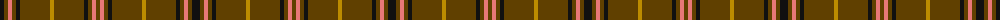

The parent of this is [Welsh National #2](/tartans/k/8/t4/lr4/t4/k4/t30/dy4/t30/k4/t4/lr4/t/4/)

This was sourced from register-of-tartans.  It is a [12 stripes tartan](/stripes/stripes12/).

Original link https://www.tartanregister.gov.uk/tartanDetails.aspx?ref=4598

## Thread count
K/8 T4 LR4 T4 K4 T30 DY4 T30 K4 T4 LR4 T/4

## Palette
Each colour and its ΔE from the base-6 reference it is a variant of.

| Colour | Shade | Base | ΔE (OKLab) |
|---|---|---|---|
| DY |  `#BC8C00` | Y  | 0.16 |
| K |  `#101010` | K  | 0.17 |
| LR |  `#E87878` | R  | 0.19 |
| LT |  `#A08858` | Y  | 0.21 |
| R |  `#C80000` | R  | 0.00 |
| T |  `#604000` | G  | 0.14 |
| Y |  `#E8C000` | Y  | 0.00 |

ID: /variants/k/8/t4/lr4/t4/k4/t30/dy4/t30/k4/t4/lr4/t/4-dybc8c00-k101010-lre87878-lta08858-rc80000-t604000-ye8c000/
