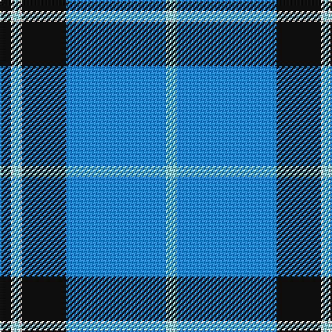

The parent of this is [NHS Grampian (Corporate)](/tartans/k/8/w2/lb4/w2/k32/b72/lb/8/)

This was sourced from tartans-authority.  It is a [7 stripes tartan](/stripes/stripes7/).

Original link http://www.tartansauthority.com/tartan-ferret/display/6219/

## Thread count
K/8 W2 LB4 W2 K32 B72 LB/8

## Palette
Each colour and its ΔE from the base-6 reference it is a variant of.

| Colour | Shade | Base | ΔE (OKLab) |
|---|---|---|---|
| B |  `#2888C4` | B  | 0.21 |
| K |  `#101010` | K  | 0.17 |
| LB |  `#98C8E8` | W  | 0.17 |
| W |  `#FCFCFC` | W  | 0.03 |

# Sample pattern

ID: /variants/k/8/w2/lb4/w2/k32/b72/lb/8-b2888c4-k101010-lb98c8e8-wfcfcfc/
