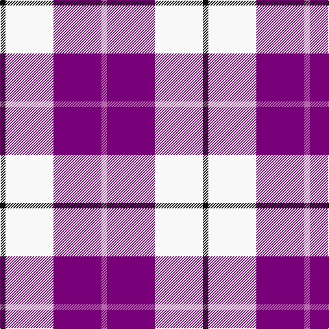

The parent of this is [MacRae - 2000 (Dress, Purple)](/tartans/k/8/w70/p70/pa/8/)

This was sourced from tartans-authority.  It is a [4 stripes tartan](/stripes/stripes4/).

Original link http://www.tartansauthority.com/tartan-ferret/display/6564/

## Thread count
K/8 W70 P70 Pa/8

## Palette
Each colour and its ΔE from the base-6 reference it is a variant of.

| Colour | Shade | Base | ΔE (OKLab) |
|---|---|---|---|
| K |  `#101010` | K  | 0.17 |
| P |  `#780078` | B  | 0.16 |
| Pa |  `#B468AC` | R  | 0.21 |
| W |  `#F8F8F8` | W  | 0.01 |

# Sample pattern

ID: /variants/k/8/w70/p70/pa/8-k101010-p780078-pab468ac-wf8f8f8/
