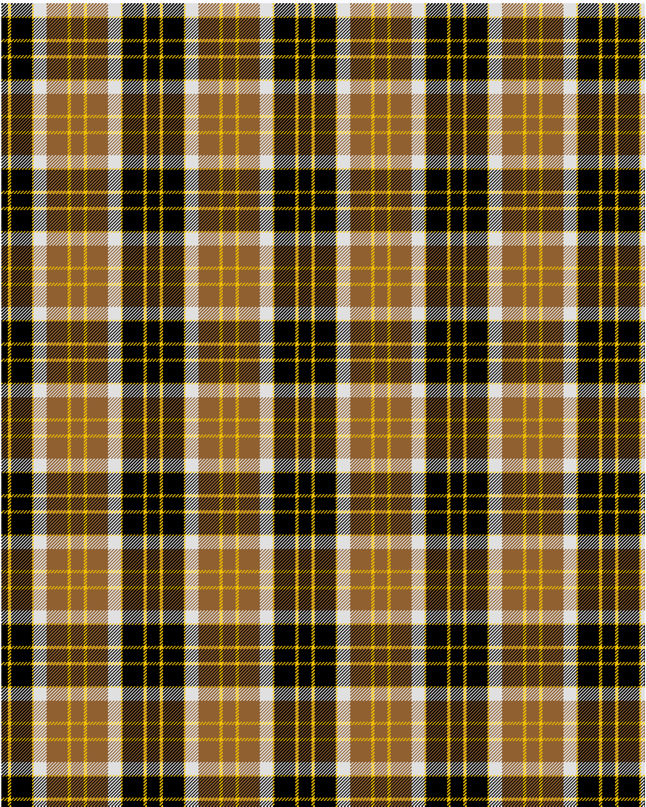

Bannockbane, Light Tan

This was sourced from <no value>.  It is a 8 stripes tartan.

Original link http://www.weddslist.com/cgi-bin/tartans/pg.pl?source=sts

## Thread count
K/8 Y4 K26 Y2 LN16 LT26 Y4 LT/8

## Palette
K#000000 LN#E0E0E0 LT#906030 Y#F0C000

# Sample pattern

ID: /variants/k/8/y4/k26/y2/ln16/lt26/y4/lt/8-k000000-lne0e0e0-lt906030-yf0c000