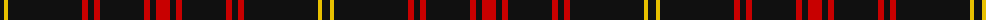

The parent of this is [Maier (Personal)](/tartans/k/8/y4/k74/r6/k6/r6/k44/r6/k6/r/14/)

This was sourced from tartans-authority.  It is a [10 stripes tartan](/stripes/stripes10/).

Original link http://www.tartansauthority.com/tartan-ferret/display/6211/

## Thread count
K/8 Y4 K74 R6 K6 R6 K44 R6 K6 R/14

## Palette
Each colour and its ΔE from the base-6 reference it is a variant of.

| Colour | Shade | Base | ΔE (OKLab) |
|---|---|---|---|
| K |  `#101010` | K  | 0.17 |
| R |  `#C80000` | R  | 0.00 |
| Y |  `#E8C000` | Y  | 0.00 |

ID: /variants/k/8/y4/k74/r6/k6/r6/k44/r6/k6/r/14-k101010-rc80000-ye8c000/
