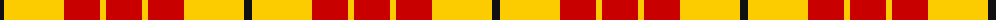
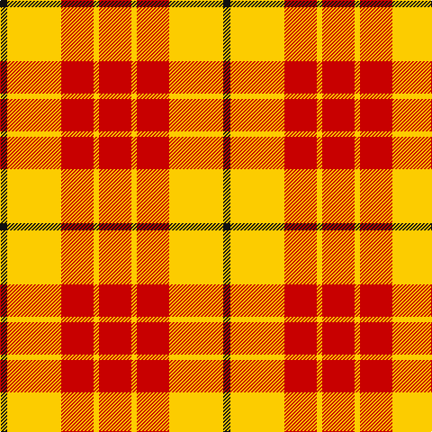

The parent of this is [Shire of Hornwood (Corporate)](/tartans/k/8/y60/r36/y6/r/36/)

This was sourced from tartans-authority.  It is a [5 stripes tartan](/stripes/stripes5/).

Original link http://www.tartansauthority.com/tartan-ferret/display/10409/

## Thread count
K/8 Y60 R36 Y6 R/36

## Palette
Each colour and its ΔE from the base-6 reference it is a variant of.

| Colour | Shade | Base | ΔE (OKLab) |
|---|---|---|---|
| K |  `#101010` | K  | 0.17 |
| R |  `#C80000` | R  | 0.00 |
| Y |  `#FCCC00` | Y  | 0.04 |

# Sample pattern

ID: /variants/k/8/y60/r36/y6/r/36-k101010-rc80000-yfccc00/
