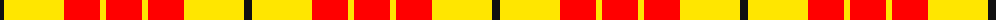

The parent of this is [Shire of Hornwood (USA)](/tartans/k/8/y60/r36/y6/r/36/)

This was sourced from register-of-tartans.  It is a [5 stripes tartan](/stripes/stripes5/).

Original link https://www.tartanregister.gov.uk/tartanDetails.aspx?ref=10409

## Thread count
K/8 Y60 R36 Y6 R/36

## Palette
Each colour and its ΔE from the base-6 reference it is a variant of.

| Colour | Shade | Base | ΔE (OKLab) |
|---|---|---|---|
| K |  `#101010` | K  | 0.17 |
| R |  `#FF0000` | R  | 0.11 |
| Y |  `#FFE600` | Y  | 0.10 |

# Sample pattern

ID: /variants/k/8/y60/r36/y6/r/36-k101010-rff0000-yffe600/
