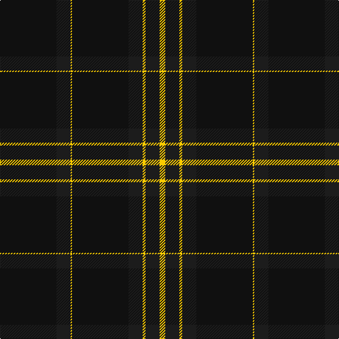

The parent of this is [1891 (Commemorative)](/tartans/k/80/ka20/y2/k80/ka20/y4/ka20/y/8/)

This was sourced from tartans-authority.  It is a [8 stripes tartan](/stripes/stripes8/).

Original link http://www.tartansauthority.com/tartan-ferret/display/10372/

## Thread count
K/80 Ka20 Y2 K80 Ka20 Y4 Ka20 Y/8

## Palette
Each colour and its ΔE from the base-6 reference it is a variant of.

| Colour | Shade | Base | ΔE (OKLab) |
|---|---|---|---|
| K |  `#101010` | K  | 0.17 |
| Ka |  `#1C1C1C` | B  | 0.20 |
| Y |  `#FCCC00` | Y  | 0.04 |

# Sample pattern

ID: /variants/k/80/ka20/y2/k80/ka20/y4/ka20/y/8-k101010-ka1c1c1c-yfccc00/
