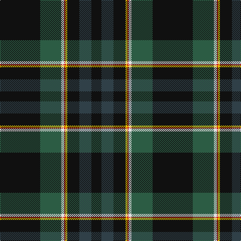

The parent of this is [MacNeill, Royce (Personal)](/tartans/k/80/n42/ln6/r2/y4/k24/na24/k/20/)

This was sourced from tartans-authority.  It is a [8 stripes tartan](/stripes/stripes8/).

Original link http://www.tartansauthority.com/tartan-ferret/display/7497/

## Thread count
K/80 N42 LN6 R2 Y4 K24 Na24 K/20

## Palette
Each colour and its ΔE from the base-6 reference it is a variant of.

| Colour | Shade | Base | ΔE (OKLab) |
|---|---|---|---|
| K |  `#101010` | K  | 0.17 |
| LN |  `#E0E0E0` | W  | 0.06 |
| N |  `#2C5C44` | G  | 0.09 |
| Na |  `#304048` | B  | 0.10 |
| R |  `#C80000` | R  | 0.00 |
| Y |  `#E8C000` | Y  | 0.00 |

# Sample pattern

ID: /variants/k/80/n42/ln6/r2/y4/k24/na24/k/20-k101010-lne0e0e0-n2c5c44-na304048-rc80000-ye8c000/
