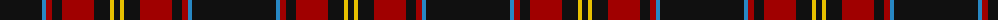

The parent of this is [Highland Brewing Company](/tartans/k/84/b4/dr6/k10/dr32/k16/y4/k/6/)

This was sourced from tartans-authority.  It is a [8 stripes tartan](/stripes/stripes8/).

Original link http://www.tartansauthority.com/tartan-ferret/display/10939/

## Thread count
K/84 B4 DR6 K10 DR32 K16 Y4 K/6

## Palette
Each colour and its ΔE from the base-6 reference it is a variant of.

| Colour | Shade | Base | ΔE (OKLab) |
|---|---|---|---|
| B |  `#2888C4` | B  | 0.21 |
| DR |  `#A00000` | R  | 0.09 |
| K |  `#101010` | K  | 0.17 |
| Y |  `#E8C000` | Y  | 0.00 |

# Sample pattern

ID: /variants/k/84/b4/dr6/k10/dr32/k16/y4/k/6-b2888c4-dra00000-k101010-ye8c000/
