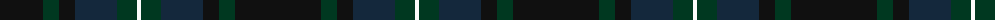

The parent of this is [Longmuir (2014)](/tartans/k/86/dg16/k16/dn42/dg20/w/4/)

This was sourced from tartans-authority.  It is a [6 stripes tartan](/stripes/stripes6/).

Original link http://www.tartansauthority.com/tartan-ferret/display/11146/

## Thread count
K/86 DG16 K16 DN42 DG20 W/4

## Palette
Each colour and its ΔE from the base-6 reference it is a variant of.

| Colour | Shade | Base | ΔE (OKLab) |
|---|---|---|---|
| DG |  `#003820` | G  | 0.16 |
| DN |  `#14283C` | B  | 0.14 |
| K |  `#101010` | K  | 0.17 |
| W |  `#FCFCFC` | W  | 0.03 |

# Sample pattern

ID: /variants/k/86/dg16/k16/dn42/dg20/w/4-dg003820-dn14283c-k101010-wfcfcfc/
