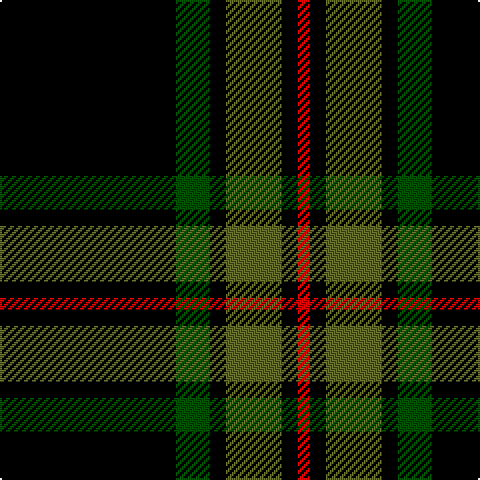

The parent of this is [Childers (Gurkha Rifles) (Military)](/tartans/k/88/ga17/k8/g28/k8/r/6/)

This was sourced from tartans-authority.  It is a [6 stripes tartan](/stripes/stripes6/).

Original link http://www.tartansauthority.com/tartan-ferret/display/1090/

## Thread count
K/88 Ga17 K8 G28 K8 R/6

## Palette
Each colour and its ΔE from the base-6 reference it is a variant of.

| Colour | Shade | Base | ΔE (OKLab) |
|---|---|---|---|
| G |  `#5C6428` | G  | 0.09 |
| Ga |  `#004C00` | G  | 0.08 |
| K |  `#000000` | K  | 0.00 |
| R |  `#C80000` | R  | 0.00 |

# Sample pattern

ID: /variants/k/88/ga17/k8/g28/k8/r/6-g5c6428-ga004c00-k000000-rc80000/
