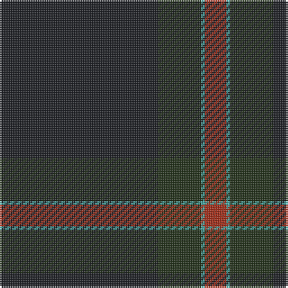

The parent of this is [Heslop Lurdenlaw by Kelso](/tartans/k/88/ka24/b2/r/12/)

This was sourced from register-of-tartans.  It is a [4 stripes tartan](/stripes/stripes4/).

Original link https://www.tartanregister.gov.uk/tartanDetails.aspx?ref=10331

## Thread count
K/88 Ka24 B2 R/12

## Palette
Each colour and its ΔE from the base-6 reference it is a variant of.

| Colour | Shade | Base | ΔE (OKLab) |
|---|---|---|---|
| B |  `#43A5A0` | G  | 0.25 |
| K |  `#1E2025` | B  | 0.18 |
| Ka |  `#23321B` | G  | 0.17 |
| R |  `#A32D18` | R  | 0.07 |

# Sample pattern

ID: /variants/k/88/ka24/b2/r/12-b43a5a0-k1e2025-ka23321b-ra32d18/
