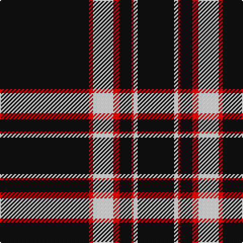

The parent of this is [Mull Rugby Club](/tartans/k/88/r4/w20/r6/k12/r2/w4/k/36/)

This was sourced from register-of-tartans.  It is a [8 stripes tartan](/stripes/stripes8/).

Original link https://www.tartanregister.gov.uk/tartanDetails.aspx?ref=11377

## Thread count
K/88 R4 W20 R6 K12 R2 W4 K/36

## Palette
Each colour and its ΔE from the base-6 reference it is a variant of.

| Colour | Shade | Base | ΔE (OKLab) |
|---|---|---|---|
| K |  `#101010` | K  | 0.17 |
| R |  `#DC0000` | R  | 0.04 |
| W |  `#FFFFFF` | W  | 0.03 |

# Sample pattern

ID: /variants/k/88/r4/w20/r6/k12/r2/w4/k/36-k101010-rdc0000-wffffff/
