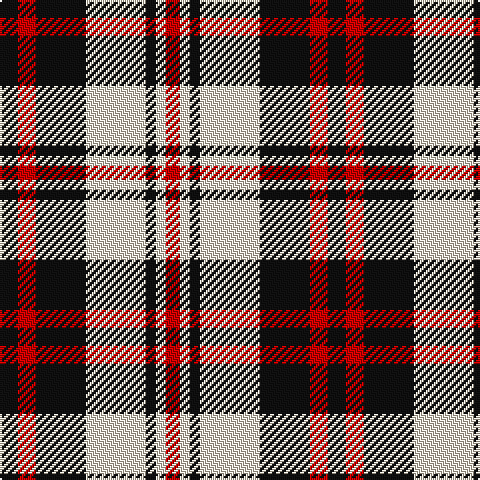

The parent of this is [Rocket Dog (Fashion)](/tartans/k/9/r9/k25/w30/k5/w5/r/7/)

This was sourced from tartans-authority.  It is a [7 stripes tartan](/stripes/stripes7/).

Original link http://www.tartansauthority.com/tartan-ferret/display/8020/

## Thread count
K/9 R9 K25 W30 K5 W5 R/7

## Palette
Each colour and its ΔE from the base-6 reference it is a variant of.

| Colour | Shade | Base | ΔE (OKLab) |
|---|---|---|---|
| K |  `#101010` | K  | 0.17 |
| R |  `#C80000` | R  | 0.00 |
| W |  `#F0E4CC` | W  | 0.05 |

# Sample pattern

ID: /variants/k/9/r9/k25/w30/k5/w5/r/7-k101010-rc80000-wf0e4cc/
