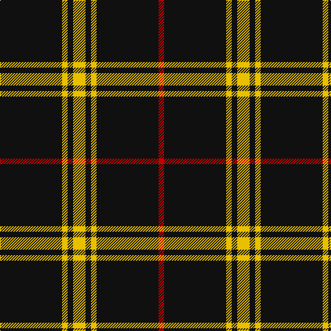

The parent of this is [Gwynn](/tartans/k/90/y8/k8/y18/k8/y8/k90/r/8/)

This was sourced from register-of-tartans.  It is a [8 stripes tartan](/stripes/stripes8/).

Original link https://www.tartanregister.gov.uk/tartanDetails.aspx?ref=1564

## Thread count
K/90 Y8 K8 Y18 K8 Y8 K90 R/8

## Palette
Each colour and its ΔE from the base-6 reference it is a variant of.

| Colour | Shade | Base | ΔE (OKLab) |
|---|---|---|---|
| K |  `#101010` | K  | 0.17 |
| R |  `#C80000` | R  | 0.00 |
| Y |  `#E8C000` | Y  | 0.00 |

# Sample pattern

ID: /variants/k/90/y8/k8/y18/k8/y8/k90/r/8-k101010-rc80000-ye8c000/
