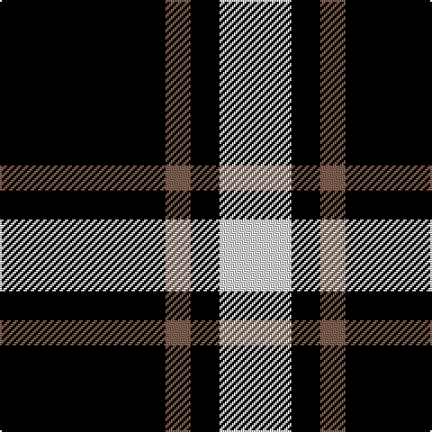

The parent of this is [Lords, of Skye](/tartans/k/92/lt14/k16/ln/40/)

This was sourced from weddslist.  It is a [4 stripes tartan](/stripes/stripes4/).

Original link http://www.weddslist.com/cgi-bin/tartans/pg.pl?source=sts

## Thread count
K/92 LT14 K16 LN/40

## Palette
Each colour and its ΔE from the base-6 reference it is a variant of.

| Colour | Shade | Base | ΔE (OKLab) |
|---|---|---|---|
| K |  `#000000` | K  | 0.00 |
| LN |  `#E0E0E0` | W  | 0.06 |
| LT |  `#806050` | R  | 0.17 |

# Sample pattern

ID: /variants/k/92/lt14/k16/ln/40-k000000-lne0e0e0-lt806050/
