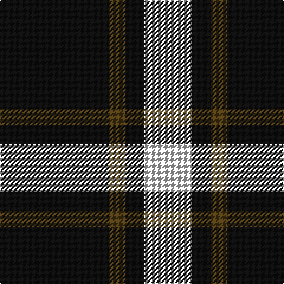

The parent of this is [Lords of Skye](/tartans/k/92/t14/k16/ln/40/)

This was sourced from register-of-tartans.  It is a [4 stripes tartan](/stripes/stripes4/).

Original link https://www.tartanregister.gov.uk/tartanDetails.aspx?ref=2217

## Thread count
K/92 T14 K16 LN/40

## Palette
Each colour and its ΔE from the base-6 reference it is a variant of.

| Colour | Shade | Base | ΔE (OKLab) |
|---|---|---|---|
| K |  `#101010` | K  | 0.17 |
| LN |  `#E0E0E0` | W  | 0.06 |
| T |  `#503C14` | G  | 0.15 |

# Sample pattern

ID: /variants/k/92/t14/k16/ln/40-k101010-lne0e0e0-t503c14/
