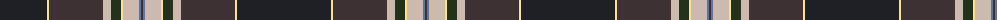

The parent of this is [Brighton Mac Dermotte](/tartans/k/94/ly2/t54/n8/ka10/ly2/n16/b2/t/2/)

This was sourced from register-of-tartans.  It is a [9 stripes tartan](/stripes/stripes9/).

Original link https://www.tartanregister.gov.uk/tartanDetails.aspx?ref=10434

## Thread count
K/94 LY2 T54 N8 Ka10 LY2 N16 B2 T/2

## Palette
Each colour and its ΔE from the base-6 reference it is a variant of.

| Colour | Shade | Base | ΔE (OKLab) |
|---|---|---|---|
| B |  `#5F749C` | B  | 0.17 |
| K |  `#1E2025` | B  | 0.18 |
| Ka |  `#23321B` | G  | 0.17 |
| LY |  `#F8E38C` | Y  | 0.11 |
| N |  `#CCBAAF` | Y  | 0.15 |
| T |  `#3D3134` | B  | 0.14 |

ID: /variants/k/94/ly2/t54/n8/ka10/ly2/n16/b2/t/2-b5f749c-k1e2025-ka23321b-lyf8e38c-nccbaaf-t3d3134/
