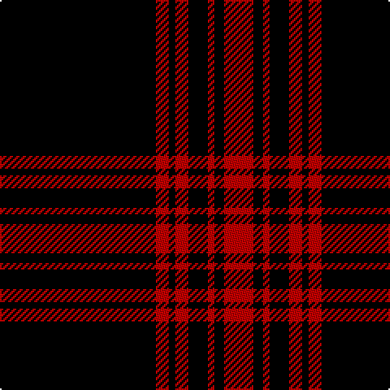

The parent of this is [Menzies, Black & Red](/tartans/k/96/r8/k4/r8/k12/r4/k6/r/18/)

This was sourced from weddslist.  It is a [8 stripes tartan](/stripes/stripes8/).

Original link http://www.weddslist.com/cgi-bin/tartans/pg.pl?source=sts

## Thread count
K/96 R8 K4 R8 K12 R4 K6 R/18

## Palette
Each colour and its ΔE from the base-6 reference it is a variant of.

| Colour | Shade | Base | ΔE (OKLab) |
|---|---|---|---|
| K |  `#000000` | K  | 0.00 |
| R |  `#C00000` | R  | 0.02 |

# Sample pattern

ID: /variants/k/96/r8/k4/r8/k12/r4/k6/r/18-k000000-rc00000/
